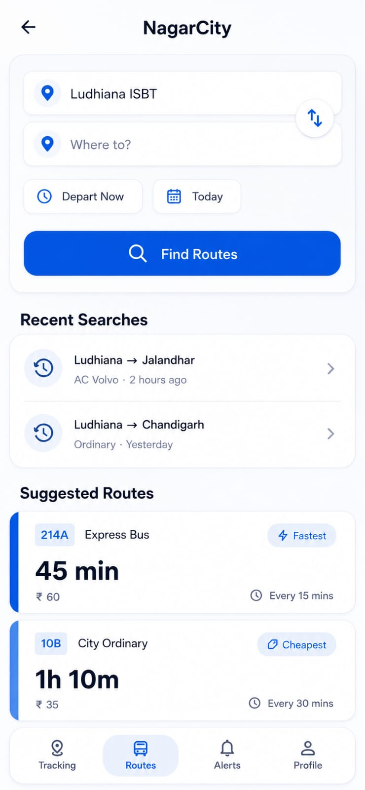
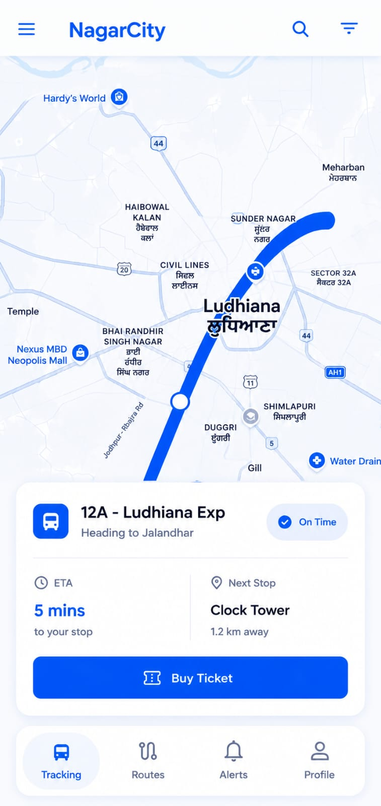
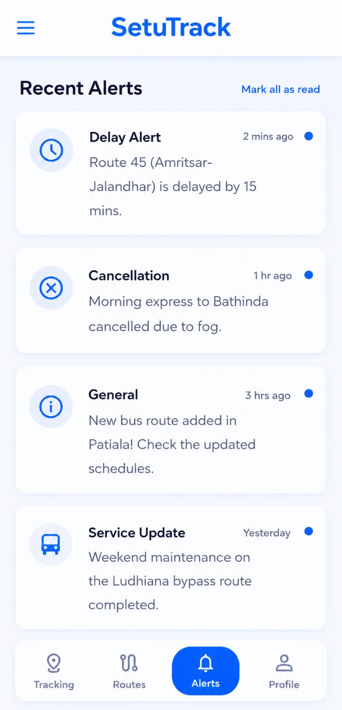
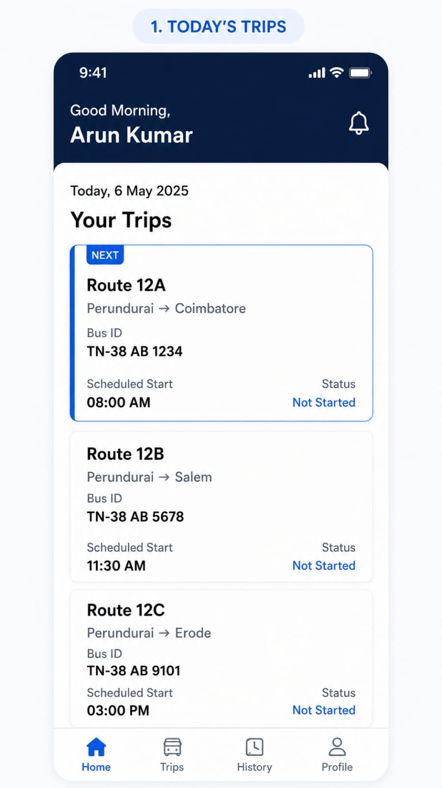
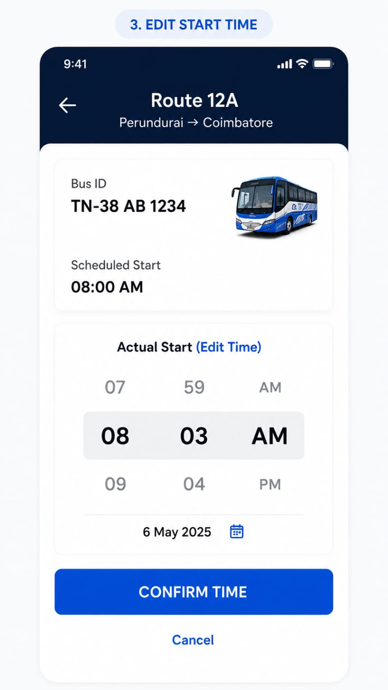
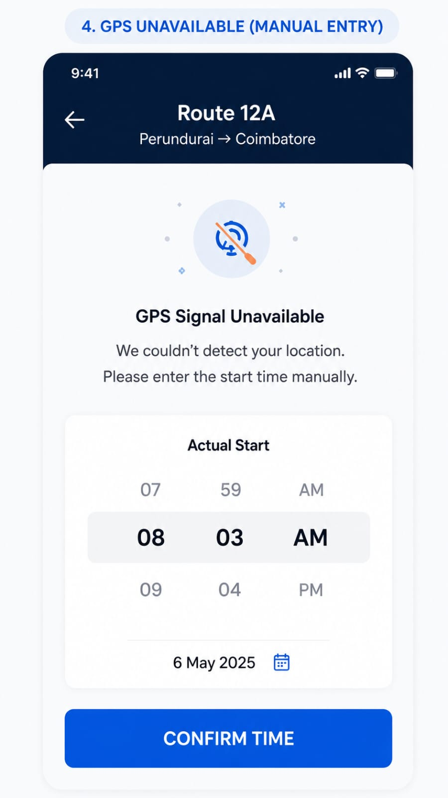
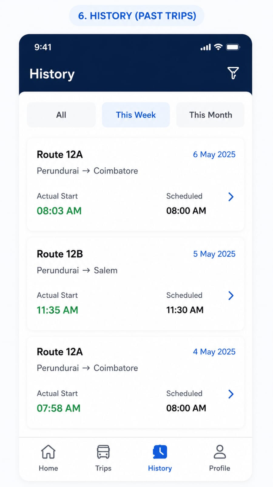
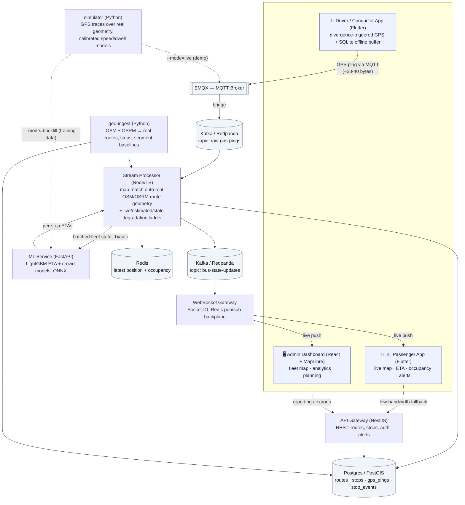

# SetuTrack

**Real-time public bus tracking built for small-city India — where the network isn't.**

SIH 2025 · Problem Statement 25013 · Government of Punjab, Dept. of Transport


-660066?logo=eclipsemosquitto&logoColor=white)

> Full solution write-up: [`SIH25013_TrackMyRide_Solution.md`](./SIH25013_TrackMyRide_Solution.md) ·
> Implementation detail & current build status: [`docs/IMPLEMENTATION_ARCHITECTURE.md`](./docs/IMPLEMENTATION_ARCHITECTURE.md)

---

## The problem

Small Punjab cities (Bathinda, Patiala, Pathankot, and similar tier-3 towns) already
run PRTC/PUNBUS bus fleets — but riders have no way to know where a bus actually is,
and the transport department has no live view of its own fleet. Off-the-shelf transit
apps assume metro-city conditions: steady 4G/5G, GPS-rich mapping data, budget-agnostic
phones. None of that holds here. Coverage is intermittent 3G/patchy 4G, drivers carry
₹6–8k Android devices, and large stretches of the actual road/stop network were never
mapped in detail. **The tracking problem in these towns is a low-bandwidth,
patchy-data-coverage problem first, and a mapping problem second** — most tracking
software treats it as neither.

## Why SetuTrack is different

| | Typical transit-tracking app | SetuTrack |
|---|---|---|
| **GPS reporting** | Fixed-interval polling, regardless of signal or need | Sends a ping only when the bus's position actually diverges from where it was predicted to be, plus a heartbeat — far less data over MQTT than always-on polling |
| **When signal drops** | Bus marker freezes silently, or vanishes | An honest three-tier **degradation ladder**: `live` → `estimated` (dead-reckoned along the real route geometry) → `stale`, each labeled on-screen so the rider knows exactly how fresh the position is |
| **Offline driver device** | Ping lost if the connection drops | Pings queue in a bounded on-device SQLite buffer and flush on reconnect, flagged so a replayed backlog can never rewind a bus's live position |
| **Route geometry** | Hand-drawn or licensed map data | Every route is real: ingested from OSM relations where they exist, and reconstructed from real stop nodes + OSRM road-network routing where they don't — provenance recorded per route, never invented coordinates |
| **ETA** | Straight-line distance ÷ average speed | A LightGBM model trained on segment-level history, blended live with the bus's current pace — measured at **5.8s MAE vs. a 49.4s naive baseline (88% improvement)** on held-out, time-based-split test data |
| **New hardware ask** | Usually assumes a new tracking device | Designed as a drop-in consumer of the GPS hardware PRTC/PUNBUS buses are already required to carry under **AIS-140** — this is a software integration play, not a hardware rollout |
| **Driver/Conductor app** | Separate app, separate codebase | One Flutter codebase for both riders and crew — a startup screen picks the role and persists it, so it's one app to install, update, and demo |

## What it does

### 🧑‍🤝‍🧑 Passenger app
- Search a route or destination and see live suggested buses, fare, and frequency
- Live map: the bus's real position on its route polyline, ETA countdown to your stop, occupancy badge (Low/Medium/Full)
- Push alerts for delays, cancellations, diversions, and service updates
- Multilingual UI (Punjabi/Hindi/English) and a voice assistant for hands-free "where's my bus" queries
- SOS button with live location, for the safety case beyond convenience

### 🚌 Driver / Conductor app
- One-tap start/end trip; GPS streams in the background over MQTT even with the screen off
- Works with no signal: pings buffer locally and sync once reconnected — nothing is lost
- Manual start-time entry as a fallback when GPS itself is unavailable
- Passenger tally (+/-) at each stop, delay-reason quick tags, trip history
- Same app as the passenger side — a role switcher, not a separate install

### 🖥️ Admin command dashboard
- Live fleet map across the whole city — every active bus, color-coded by status
- Route performance: on-time %, average delay, and the specific road segments that are consistently slower than scheduled
- Demand-supply planning view — overlays predicted ridership against current bus allocation per route, surfacing "this route is over-supplied at 11am, under-supplied at 6pm" calls
- Model-health view: live ETA accuracy trend and per-bus data-freshness, so an operator can see when a device has gone dark
- Alerts & SOS panel for breakdowns, route deviation, and driver/passenger SOS presses

<details>
<summary><strong>Concept UI — passenger app</strong> (early design mockups, not live screenshots)</summary>
<br>

| Route search & discovery | Live tracking & ETA | Alerts |
|---|---|---|
|  |  |  |

</details>

<details>
<summary><strong>Concept UI — driver / conductor app</strong> (early design mockups, not live screenshots)</summary>
<br>

| Today's trips | Edit start time | GPS unavailable → manual entry | Trip history |
|---|---|---|---|
|  |  |  |  |

</details>

## Architecture

One real-time backbone feeds all three apps: GPS pings flow in over MQTT, get
map-matched onto real route geometry and scored for ETA, then fan out live over
WebSockets — with REST as a low-bandwidth polling fallback and a bounded on-device
buffer covering the driver side whenever the network itself disappears.



**Why this shape, in one line each:**
- **MQTT in front of Kafka** — MQTT is the standard fit for many low-power, lossy, small-message connections (fleet telemetry); Kafka decouples ingestion from the map-matcher, historian, and analytics consumers so a burst on one bus never stalls another.
- **Map-matching before ETA** — raw lat/lon is noisy; snapping it onto the real route polyline is what makes "% of route complete" and "distance to next stop" geometrically honest.
- **Batched ETA scoring** — the ML service is called once a second across the whole active fleet, not once per GPS ping, so inference cost stays flat as the fleet grows.
- **WebSocket rooms per route/bus** — a client only receives updates for what it's actually viewing, so payload volume scales with viewers, not total fleet size.
- **REST fallback + local buffering** — the two places the network is least reliable (a phone with 2 bars, a bus in a dead zone) both degrade gracefully instead of failing.

## Tech stack

| Layer | Choice | Why |
|---|---|---|
| Passenger + Driver app | **Flutter** | One codebase, both roles, both platforms |
| Admin dashboard | **React + TypeScript + Vite + Tailwind + MapLibre GL** | Fast iteration, open-map rendering, no per-load licensing cost at govt scale |
| Business API | **NestJS** | Typed, structured REST for routes/stops/buses/tickets/auth |
| ML inference | **FastAPI + ONNX Runtime** | Low-latency CPU inference, no GPU box needed for a small-city deployment |
| Real-time ingestion | **MQTT (EMQX)** | Purpose-built for many small, lossy, low-power telemetry connections |
| Real-time fan-out | **Socket.IO / WebSocket** | Rich live UI push to phones and the dashboard |
| Stream processing | **Kafka (Redpanda)** | Decouples ingestion from every downstream consumer |
| Geospatial store | **PostgreSQL + PostGIS** | Real GIS queries (`ST_LineLocatePoint`, `ST_LineSubstring`) power map-matching and ETA |
| Cache | **Redis** | Sub-millisecond "current position" and "current occupancy" reads |
| Route/stop data | **OSM + OSRM (self-hosted)** | Real road network and route geometry, not invented coordinates |
| ML model | **LightGBM → ONNX** | Fast, explainable, wins on this data volume without needing a GPU |

## Repo layout

```
apps/
  mobile-app/        Flutter — one app, both roles; startup screen picks Passenger vs Driver/Conductor
  admin-dashboard/    React + TS + Vite + Tailwind — fleet map, analytics, planning views
services/
  api-gateway/        NestJS — routes/stops, buses (REST fallback), tickets, auth
  ml-service/         FastAPI — ETA and crowd-prediction inference (ONNX, LightGBM)
  stream-processor/   Node/TS — MQTT ingestion, map-matching, ETA scoring, Kafka + Socket.IO fan-out
  geo-ingest/         Python — real OSM/OSRM route + stop ingestion (see its own README)
  simulator/          Python — GPS simulator: real routes, calibrated speed/dwell, MQTT live + training backfill
packages/
  shared-types/       TypeScript types shared between admin-dashboard and stream-processor
  dead-reckoning/     the live/estimated/stale degradation-ladder logic
db/
  migrations/         versioned PostGIS schema
data/
  snapshots/           committed GeoJSON/GTFS export of the ingested city (so a demo never needs the network)
docs/
  IMPLEMENTATION_ARCHITECTURE.md   component-by-component build status, data model, API surface
infra/
  docker/, k8s/        OSRM build + deployment manifests
docker-compose.yml     local dev infra: Postgres/PostGIS, Redis, Redpanda (Kafka API), EMQX (MQTT), self-hosted OSRM
```

This is an npm workspace at the root (`apps/admin-dashboard`, `services/api-gateway`,
`services/stream-processor`, `packages/shared-types`) — the Flutter app and the
Python services (`ml-service`, `geo-ingest`, `simulator`) are outside the npm
workspace and managed with their own toolchains.

## Running it locally

1. **Infra**
   ```
   docker compose up -d
   ```
   Brings up Postgres/PostGIS, Redis, Redpanda, EMQX, and a self-hosted OSRM instance.

2. **JS/TS services** (from repo root — installs all workspaces at once)
   ```
   npm install
   npm run --workspace services/api-gateway start:dev
   npm run --workspace services/stream-processor dev:consumer
   npm run --workspace services/stream-processor dev:gateway
   npm run --workspace apps/admin-dashboard dev
   ```
   Copy each service's `.env.example` to `.env` first.

3. **ml-service**
   ```
   cd services/ml-service
   python -m venv .venv && source .venv/Scripts/activate  # or .venv/bin/activate on macOS/Linux
   pip install -r requirements.txt
   uvicorn app.main:app --reload
   ```

4. **mobile-app** — needs the Flutter SDK.
   ```
   cd apps/mobile-app
   flutter pub get
   flutter run
   ```
   See its own [README](apps/mobile-app/README.md) if the `android/`/`ios/`/`web/`
   platform folders ever need regenerating (`flutter create .`).

5. **simulator** (once infra is up) — drives the whole real pipeline with simulated
   buses on real routes:
   ```
   cd services/simulator
   python -m venv .venv && source .venv/Scripts/activate
   pip install -r requirements.txt
   python -m app.main --mode live --buses 5
   ```
   See its own README for backfill mode (generating the ML training corpus) and
   what's been verified end-to-end.

## Project status

This is an active SIH 2025 build, not a finished product — and it's more honest to say
exactly where the line is than to imply otherwise.

| Component | State |
|---|---|
| `services/geo-ingest` | ✅ Real OSM/OSRM ingestion — 103 real route directions for the Mohali tricity, committed as a GeoJSON/GTFS snapshot |
| `services/simulator` | ✅ GPS simulator verified against all 100+ real routes, both live-demo and 90-day training-backfill modes |
| `services/stream-processor` | ✅ Real map-matching, degradation ladder, and batched ETA scoring wired end-to-end and verified live (Kafka consumer lag 0) |
| `services/ml-service` | ✅ LightGBM ETA model trained and live: 5.8s MAE vs. 49.4s naive baseline on held-out data |
| `apps/admin-dashboard` | 🟡 Live Fleet Map is real (MapLibre + Socket.IO); the other 5 planned views are stubs |
| `apps/mobile-app` | 🟡 Driver flow's GPS transmitter + offline buffer is real and tested; passenger flow is still screen stubs |
| `services/api-gateway` | 🟡 4 modules scaffolded (routes/buses/tickets/auth), stub returns |
| Ticketing (UPI + offline QR validation) | ⚪ Designed, deliberately descoped from this round — see §9 of the architecture doc |

Full component-by-component detail, what's verified vs. still a gap, and the reasoning
behind every deviation from the original design lives in
[`docs/IMPLEMENTATION_ARCHITECTURE.md`](./docs/IMPLEMENTATION_ARCHITECTURE.md).

## Why this approach wins on the actual ask

- **"Low-bandwidth optimized"** gets concrete engineering — divergence-triggered pings, offline queues, degraded UI modes — not a slide bullet.
- **AIS-140** is the deployability hook: PRTC/PUNBUS buses already carry government-mandated GPS trackers, so this is a *software integration* play, not a hardware ask.
- Tracking data becomes **planning intelligence** via the demand-supply view — the difference between a maps clone and a government decision-support tool.
- The build order protects one thing above all: a real, judge-visible **live GPS → ETA → map** loop, working end-to-end, even if later polish runs out of time.
